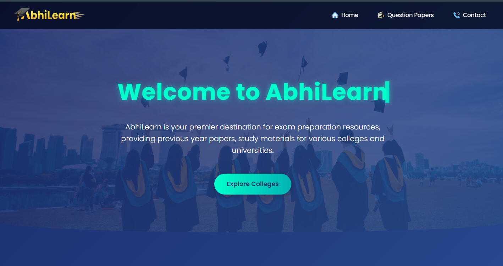

# 📚 Abhilearn.in

> **Live Academic Resource Platform** · A platform providing university-specific previous-year question papers and study materials for college students.

🌐 **Live Website:** https://abhilearn.in

---

## 📌 Overview


**Abhilearn.in** is an academic resource platform built to help college students quickly find and access previous-year question papers and study materials relevant to their university, semester, subject, and academic year.

Instead of manually searching through folders or scattered files, students can select their academic details and retrieve the relevant resources through a structured interface.

Since its launch, the platform has reached **2,000+ unique users/visitors**.

---

## ✨ Key Features

- 📚 University-specific academic resources
- 📝 Previous-year question papers
- 🎓 Semester and subject-based filtering
- 📅 Year-based resource selection
- 🔎 Structured resource retrieval
- ☁️ Supabase Storage integration
- 📱 Responsive student-focused interface

---

# 🔄 How It Works

The resource retrieval flow connects the student's selections with the corresponding academic resources stored in Supabase.

```text
                Student
                   │
                   ▼
          Select University
                   │
                   ▼
             Select Semester
                   │
                   ▼
             Select Subject
                   │
                   ▼
             Select Year
                   │
                   ▼
          Supabase Database
                   │
                   ▼
        Find Matching Resource
                   │
                   ▼
        Supabase Storage
                   │
                   ▼
        📄 Question Paper
